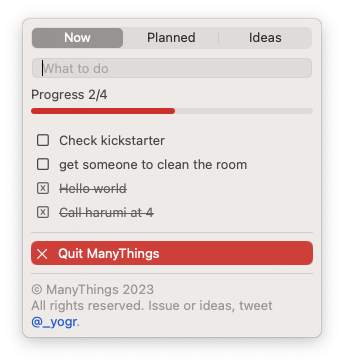

# *ManyThings

Inspired by 1Thing by [sindresorhus](https://github.com/sindresorhus). 1Thing allowed for setting one goal at a time. But I also needed to be reminded about other stuff — many things. This app runs in the menu bar.

## Download

⚠️ To launch app for the first time, right click and select open.

Check the releases page for the latest package. Simply drag package to your `Applications` folder and open.
